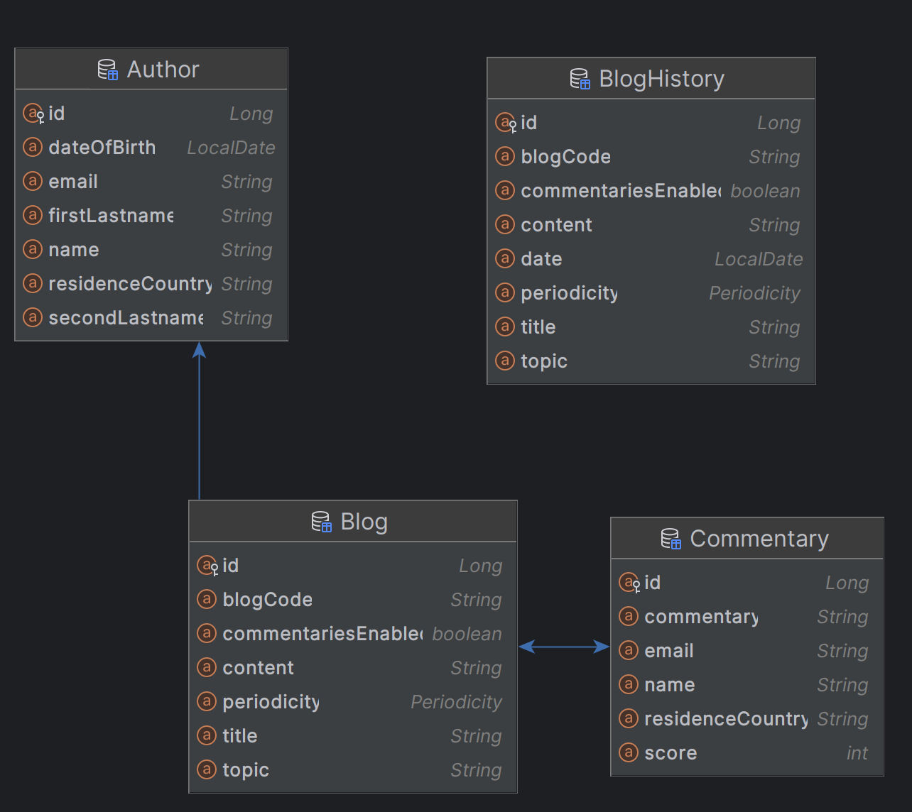

# blog-management

This application provides a small blog management APIs REST, allowing to create, update, and retrieve blogs, besides register comments for the blogs.
-----
Para la aplicacion de gestion de BLogs, se utilizó Java 21 y Spring Boot 3 para desarrollar servicios RESTful robustos y
escalables, con Gradle para la gestión de dependencias y H2 como base de datos ligera en desarrollo. La solución se
trabajo con Docker para asegurar consistencia en todos los entornos. Siguiendo una arquitectura modular y pruebas
automatizadas, logrando asi una plicacion eficiente, confiable y fácil de mantener.

## Requirements:

- Java 21
- SpringBoot 3
- Gradle 8.4
- H2
- Docker 25
- JUnit
- Currently, only tested on Fedora 39 and IntelliJ IDEA

## How to run locally:

```bash
cd blog-management
gradle clean
gradle bootRun
```

## Run with Docker:

```bash
cd blog-management
gradle clean build
docker build --no-cache --build-arg JAR_FILE=build/libs/\*.jar -t renvl/blog-management .
docker run -p 8080:8080 -t renvl/blog-management
```

## Database Design



Available Blogs

| blog\_title |
|:------------|
| blog one    |
| blog two    |
| blog three  |
| blog four   |

## API:

#### http[]()://localhost:8080/api

### Blog

#### /api/blog

* `POST` : Create Blog

    ```bash
    curl --request POST \
      --url http://localhost:8080/api/blog \
      --header 'Content-Type: application/json' \
      --data '{
        "author": {
          "name": "string",
          "firstLastname": "string",
          "secondLastname": "string",
          "dateOfBirth": "yyyy-MM-dd",
          "residenceCountry": "string",
          "email": "string"
        },
        "blog": {
          "title": "string",
          "topic": "string",
          "content": "string",
          "periodicity": "DAILY",
          "commentariesEnabled": true
        }
      }'
    ```

#### /api/blog/{blogCode}

* `GET` : Retrieve Blog

### Author

#### /api/author

* `POST` : Create Author

    ```bash
    curl --request POST \
    --url http://localhost:8080/api/author \
    --header 'Content-Type: application/json' \
    --data '{
      "name": "string",
      "firstLastname": "string",
      "secondLastname": "string",
      "dateOfBirth": "yyyy-MM-dd",
      "residenceCountry": "string",
      "email": "string"
    }'
    ```

### Commentary

#### /api/commentary

* `POST` : Create Commentary

    ```bash
    curl --request POST \
    --url http://localhost:8080/api/commentary \
    --header 'Content-Type: application/json' \
    --data '{
      "blogCode": "string",
      "commentary": {
        "commentary": "string",
        "name": "string",
        "residenceCountry": "string",
        "email": "string",
        "score": 10
      }
    }'
    ```

## Swagger-ui

http://localhost:8080/swagger-ui/index.html Swagger-UI formatted documentation.

NB!, in the API documentation pages, documentations for POST and GET requests for the blog-management can be seen.
Moreover, in Swagger UI for example, making a query is quite easy with example formats.

## Parametrization:

To set some properties or to connect another database, use the properties according
to [application.properties](src/main/resources/application.properties)

## License

blog-management is distributed under the terms of the
[MIT License](https://choosealicense.com/licenses/mit).
